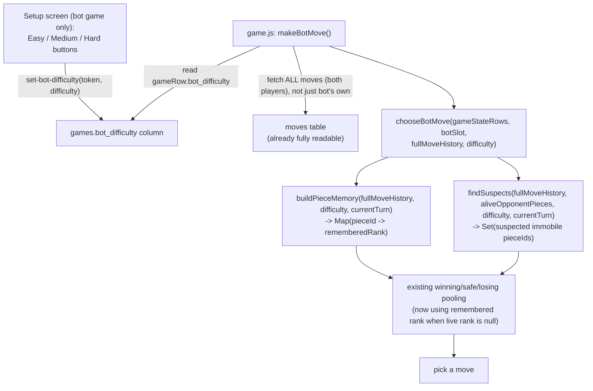

# Bot difficulty: memory + immobile-piece suspicion

## Goal

Give the "Play vs Bot" opponent an Easy/Medium/Hard difficulty, chosen on the setup screen, without turning it into a search-based engine (explicitly out of scope, per the original bot design doc). The bot stays a one-ply greedy heuristic; difficulty only changes how much of the game's own history it pays attention to.

Two features, both scaling in strength across all three tiers (not feature-gated on/off):

1. **Reveal memory** — remember a piece's combat-revealed rank for a while after fog-of-war resets it to unknown on the live board, scaled by how important that rank is to know about.
2. **Immobile-piece suspicion** — notice opponent pieces that have never moved, and treat them as likely Bomb/Flag candidates.

## Non-goals

- No lookahead/minimax/search of any kind. The bot remains one-ply greedy; difficulty only affects what it *knows*, not how deeply it *plans*.
- No positional weighting for suspicion (e.g. "back row squares are more suspicious"). Left as a documented future enhancement, not built now.
- No change to the deterministic rules engine (combat resolution, legality, turn order). Randomness is confined to the bot's own heuristic judgment calls.
- Difficulty is locked in during setup; no mid-game adjustment.

## Architecture



Two new pure, independently-testable helper modules; `bot.js`'s `chooseBotMove` stays the orchestrator and keeps its existing winning/safe/losing bucket structure (existing tests keep passing unmodified — the buckets just get better inputs).

## Storage

New migration: `games.bot_difficulty text check (bot_difficulty in ('easy', 'medium', 'hard'))`, nullable. `null` is treated as `'medium'` by `chooseBotMove`. Only meaningful when `is_bot_game = true`.

The `games` table has no client-writable RLS policy (only `games_select`), so this can't be a direct client `.update()` — it needs a server-side write.

### New Edge Function: `set-bot-difficulty`

Request: `{ token, difficulty }` where `difficulty` is one of `'easy' | 'medium' | 'hard'`.

Validation (same shape as `submit-setup`/`rematch`):
1. Look up `game_players` by `secret_token`; 401 `INVALID_TOKEN` if not found.
2. Confirm this player is slot 1 (the human) — the bot itself never calls this.
3. Fetch the game; confirm `is_bot_game = true` and `status = 'setup'`; 409 `NOT_ALLOWED` otherwise.
4. Validate `difficulty` is one of the three allowed values; 400 `INVALID_DIFFICULTY` otherwise.
5. Update `games.bot_difficulty` via service role.

## UI (`setup.html` / `setup.js`)

`setup.js` already fetches the `games` row by room code (currently `select("id")`) — extend that select to `is_bot_game, bot_difficulty`.

New button row, rendered only when `is_bot_game`, placed alongside the existing Random/Defensive/Aggressive/Clear row:

```
Bot difficulty:  [ Easy ]  [ Medium ]  [ Hard ]
```

- Same visual/interaction pattern as the formation buttons: click → immediately calls `set-bot-difficulty` → updates selected-state styling. No separate confirm step.
- Defaults to Medium selected if `bot_difficulty` is still `null`.
- Not shown at all for human-vs-human games.

## Reveal memory

Keyed by **strategic importance tier**, not raw rank number (Spy is rank 10 but high-value intel; Bomb never moves so it's a permanent fact, not a decaying one).

| Importance tier | Ranks | Easy (turns) | Medium (turns) | Hard (turns) |
|---|---|---|---|---|
| Critical | Marshal, Spy | 5 | 15 | whole game |
| Bomb (special-cased, not scaled) | Bomb | whole game | whole game | whole game |
| High | General, Colonel | 3 | 10 | 25 |
| Medium | Major, Captain | 2 | 6 | 15 |
| Low | Lieutenant, Sergeant, Miner | 1 | 3 | 8 |
| Minor | Scout | 0 | 2 | 4 |

- Bomb has its own row, deliberately not folded into the Critical tier's per-difficulty numbers: it's remembered for the whole game at **every** difficulty, including Easy. Since Bombs are immobile, "forgetting" one already revealed by a failed attack isn't a decay question, it's a permanent fact at any skill level. This is the one deliberate exception to "everything scales with difficulty," and it must be implemented as an unconditional-Infinity special case in `buildPieceMemory`, not as a lookup into the Critical tier's `{easy: 5, medium: 15, hard: Infinity}` table (which is for Marshal/Spy, and does scale).
- Flag is not in this table — it only gets identity-revealed at game-over (attacking it ends the game), so it's covered entirely by suspicion, not memory.
- Easy's Minor-tier window of 0 turns means Easy behaves exactly like today's un-modified bot for Scouts specifically.

### Jitter

**Deviation from a naive "roll once and cache" implementation:** the bot has no persistent per-game state object between turns — `makeBotMove` re-fetches everything fresh from the database every turn, matching the codebase's existing stateless/self-healing philosophy (e.g. `move_number` is derived from actual table content rather than trusted from a counter, precisely so nothing needs cross-call caching). A literal `Math.random()` roll would need somewhere to be cached, or it would re-roll every turn and cause a piece's suspicion/memory status to flicker unpredictably turn to turn even though nothing about the game state changed.

Fix: use a **deterministic hash of a stable seed** instead of `Math.random()`. Hashing `${pieceId}:${moveNumber}` (for a memory reveal) or `pieceId` (for a suspicion threshold) into a value in `[0, 1)` gives the exact same "roll" every time it's queried for that seed, with no storage needed — mathematically equivalent to "rolled once and cached," achieved statelessly:

```
actualWindow = baseWindow(tier, difficulty) * jitterFactor(seed)
jitterFactor(seed) = 0.8 + hash(seed) * 0.4   // range [0.8, 1.2], i.e. ±20%
```

New shared helper `web/js/deterministicJitter.js` exports `jitterFactor(seed, seedFn = defaultJitterSeed)` — the `seedFn` parameter (not a plain `rng`) is what makes this testable: production uses the real hash, tests inject a fake `seedFn` (e.g. `() => 0` or `() => 1`) to deterministically hit the exact `0.8`/`1.2` boundaries regardless of what seed string is passed.

### `buildPieceMemory(moveHistory, difficulty, currentTurn, seedFn = defaultJitterSeed)`

Pure function. Walks `moveHistory` (every combat move in the game, both players — the full unfiltered set already available from the `moves` table), and for each combat event:
1. Determine the revealed piece's rank and importance tier.
2. Compute `actualWindow` per the jitter formula above.
3. If `currentTurn - eventTurn <= actualWindow`, add `pieceId -> rank` to the returned map.

Later reveals of the same `pieceId` overwrite earlier ones (most recent reveal wins).

## Immobile-piece suspicion

`findSuspects` flags currently-alive opponent pieces whose `piece_id` has never appeared as a mover in the move history, once the game has gone on long enough that "hasn't moved yet" is meaningful signal.

| Difficulty | Base suspicion threshold (turns with zero moves) | Avoid-with-valuable-pieces | Probe-when-idle |
|---|---|---|---|
| Easy | 30 | on (rarely relevant at this threshold) | never |
| Medium | 15 | on | 50% chance when idle and a suspect exists |
| Hard | 8 | on | always, when idle and a suspect exists |

### Jitter

Same deterministic-hash approach as reveal memory (see above), seeded by `pieceId` alone (a piece's suspicion threshold doesn't depend on a specific move event, just on which piece it is):

```
actualThreshold = baseThreshold(difficulty) * jitterFactor(pieceId)
```

### `findSuspects(moveHistory, aliveOpponentPieces, difficulty, currentTurn, seedFn = defaultJitterSeed)`

Pure function returning `Set<pieceId>` for pieces past their (jittered) threshold with zero recorded moves.

### Behavior change in `chooseBotMove`

Two explicit, non-overlapping rank sets:
- **Valuable (avoid sending onto suspected squares):** Marshal, General, Colonel, Major, **Spy** (Spy is precious despite its high rank number — only one exists, and it's the sole counter to an enemy Marshal).
- **Probe-eligible (prefer sending onto suspected squares when idle):** Captain, Lieutenant, Sergeant, Miner, Scout — mid/low value, multiple copies each; Miner is a particularly good probe piece since it's also the only rank that can safely defuse a Bomb.

- **Avoid with valuable pieces:** when choosing within the winning/safe pools, deprioritize (soft preference, not a hard block) moving a Valuable-tier piece onto a suspected square. Only send one there if it's the only legal option in that pool.
- **Probe when idle:** when there's no winning move and the bot would otherwise pick a random safe move, and the difficulty's probe roll succeeds, prefer a safe move that lands a Probe-eligible piece on a suspected square over an unrelated random safe move.

## Integration into `chooseBotMove`

New signature: `chooseBotMove(gameStateRows, botSlot, fullMoveHistory, difficulty, currentTurn, rng = Math.random)`.

Note there are two distinct kinds of randomness here, not one: `pieceMemory`/`pieceSuspicion`'s jitter uses the deterministic `seedFn` (always `defaultJitterSeed` in production — it's not exposed as a `chooseBotMove` parameter, since it never needs to vary turn to turn). `rng` is ordinary per-turn randomness (`Math.random` in production), used for the probe-when-idle roll and for picking randomly within the final move pool (already existing behavior).

1. Build `pieceMemory = buildPieceMemory(fullMoveHistory, difficulty, currentTurn)`.
2. Build `suspects = findSuspects(fullMoveHistory, aliveOpponentPieces, difficulty, currentTurn)`.
3. In the existing per-move loop: when resolving a defender's rank, if the live `defender.rank` is `null`, check `pieceMemory` first — if present, use the remembered rank for the win/safe/loss classification instead of treating it as unknown-safe.
4. After the existing pools are built, apply the suspicion-based reordering/biasing described above before picking the final move.

## Changed call sites

- `web/js/game.js`'s `makeBotMove`: currently fetches only the bot's own move history (`.eq("player_slot", BOT_SLOT)`). Needs to fetch the full game's move history (drop that filter) and pass it through, along with `gameRow.bot_difficulty`, to `chooseBotMove`.
- `currentTurn` is derived as `fullMoveHistory.length` (the count of recorded moves), **not** `games.turn_number`. `PROJECT_MEMORY.md` documents that `turn_number` has a known history of drifting after partial-write failures, which is exactly why `moves.move_number` was already changed to be self-healingly derived from actual table content instead of trusted from that counter. Memory/suspicion decay should follow that same established pattern rather than reintroducing a dependency on the less-reliable counter.

## Deviation (found while writing the implementation plan)

The `moves` table only records `piece_id` for the **attacker** (the piece that moved) — there is no `defender_piece_id` column. `buildPieceMemory` needs to attribute a remembered rank back to a specific `piece_id` so it stays correct even if that piece moves again later (a square-based fallback would misattribute an old reveal to a different, later, unrelated piece that happens to land on the same now-vacated square within the memory window — a real correctness gap, not just a style preference).

Fix: `defenderPiece.id` is already computed inside `applyMove` (`src/rules/game.js`) but never surfaced. Add `defenderPieceId` to `combatResult` there (one line), thread it through `make-move`'s `moves` insert as a new nullable `defender_piece_id` column (one migration + one line in `make-move/index.ts`). `game.js` exists in three byte-identical synced copies (`src/rules/`, `web/js/rules/`, `supabase/functions/_shared/rules/`) that must all be updated together, per existing project convention — confirmed via `md5` before making this change.

This adds one task to the plan (Task 1) ahead of everything else, since `buildPieceMemory` depends on this column existing and being populated.

## Files

**New:**
- `web/js/deterministicJitter.js` — `jitterFactor`, `defaultJitterSeed`
- `web/js/pieceMemory.js` — `buildPieceMemory`
- `web/js/pieceSuspicion.js` — `findSuspects`
- `test/web/deterministicJitter.test.js`
- `supabase/functions/set-bot-difficulty/index.ts`
- `supabase/migrations/0006_defender_piece_id.sql`
- `supabase/migrations/0007_bot_difficulty.sql`
- `test/web/pieceMemory.test.js`
- `test/web/pieceSuspicion.test.js`
- `test/rules/game.test.js` additions covering `combatResult.defenderPieceId` (existing file, new test cases)

**Modified:**
- `src/rules/game.js` + `web/js/rules/game.js` + `supabase/functions/_shared/rules/game.js` (byte-identical synced copies) — `applyMove` includes `defenderPieceId` in `combatResult`
- `supabase/functions/make-move/index.ts` — inserts `defender_piece_id`
- `web/js/bot.js` — `chooseBotMove` signature + integration
- `web/js/game.js` — `makeBotMove` fetches full move history (including `defender_piece_id`), reads `bot_difficulty`
- `web/js/setup.js` — difficulty button row, gated on `is_bot_game`
- `web/setup.html` — button markup
- `web/css/styles.css` — difficulty button selected-state styling
- `test/web/bot.test.js` — tests for memory-influenced combat resolution and suspicion-influenced pool selection

## Testing plan

- TDD throughout: failing tests for `buildPieceMemory` and `findSuspects` written before implementation, covering each importance tier × difficulty combination and both jitter boundaries (inject `seedFn = () => 0` and `seedFn = () => 1` to hit the exact min/max of each `[0.8, 1.2]` range, regardless of the real seed string).
- `chooseBotMove` tests: a piece remembered via `pieceMemory` should be treated as known for combat-outcome purposes even when its live `rank` is `null`; a suspected square should be deprioritized for valuable attackers and preferred for probes when idle (with injected `rng` forcing the probe-when-idle roll to succeed/fail deterministically).
- Full suite (`npm test`) must stay green, including all 57 existing tests.
- One live Playwright smoke test against a Hard-difficulty bot game, sanity-checking it runs without errors across several turns (not exhaustive verification of the heuristic's quality — that's inherently fuzzy/random by design).

## Rollback plan

- Revert the migration (drop `bot_difficulty` column) and the new Edge Function.
- Revert `bot.js`/`game.js`/`setup.js`/`setup.html` to their pre-feature versions.
- No data migration concerns — this is purely additive; existing bot games without the column keep working (`null` → treated as medium, or simply irrelevant for already-finished games).

## Dead code removal

None — this is additive to the existing bot. No existing behavior is being replaced, only augmented (the win/safe/loss pooling core stays as-is).
