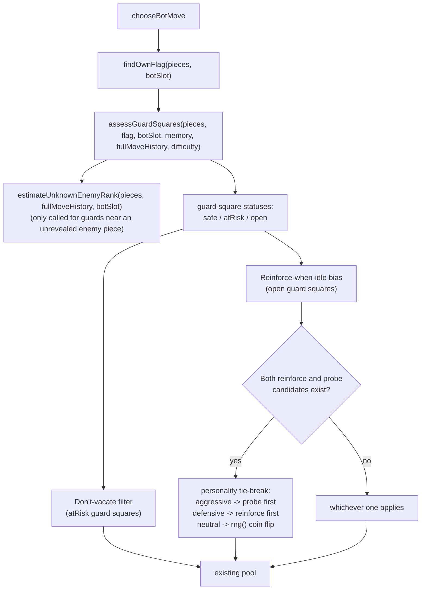

# Bot flag defense + personality (Aggressive/Neutral/Defensive)

## Goal

Give the bot minimal, non-lookahead awareness of threats to its own Flag: avoid abandoning a guard square that's actually in danger, and proactively fill an open guard square when idle. Pair this with a new, independent "personality" axis (Aggressive/Neutral/Defensive) that resolves the one real conflict this creates — reinforcing the Flag vs. probing a suspected enemy square both want the same idle turn.

This is a follow-on to the already-shipped bot-difficulty feature (`2026-07-12-bot-difficulty-design.md`) and reuses its building blocks (`resolveCombat`, `pieceMemory`'s reveal tracking, the existing winning/safe/losing pooling in `chooseBotMove`) rather than duplicating them.

## Non-goals

- No lookahead/search of any kind — this stays a static positional check on the current turn, same constraint as the difficulty feature.
- No broader "personality" behavior beyond the one tie-break described below (no aggressive-bot-trades-more-readily, no defensive-bot-avoids-risk-elsewhere). That would be a separate future feature, explicitly deferred.
- No path/reachability simulation for "can this enemy piece actually get here" — proximity is approximated by a fixed radius per difficulty, not a real path search (see Known limitations).
- No mid-game personality changes — same convention as difficulty, locked in during setup.

## Key insight driving the design

Attacking the Flag always succeeds regardless of the attacker's rank:

```46:48:src/rules/game.js
    if (defenderPiece.rank === RANK.FLAG) {
      winnerSlot = playerSlot;
    }
```

(and, in `combat.js`, `resolveCombat` returns `ATTACKER_WINS` unconditionally when the defender is `FLAG`). So the Flag itself is never "defended" by combat — what actually protects it is whether an enemy piece can get *adjacent* to it at all. A square orthogonally adjacent to the Flag that's occupied by one of the bot's own pieces ("a guard square") blocks that approach entirely unless the enemy piece can first defeat the guard. An *empty* adjacent square is a gap an enemy piece can simply walk into, then attack the Flag next turn.

This reframes "flag safety" as: for each guard square, is it (a) safely held, (b) held but the guard could plausibly lose, or (c) empty. That's the entire state space this feature reasons about — no danger-weight tables, no vector fields.

## Architecture



New module: `web/js/flagDefense.js` (pure). New DB column + Edge Function + UI for personality, mirroring the existing `bot_difficulty` pattern exactly.

## Personality: storage + UI

Same shape as `bot_difficulty`:

- New migration: `games.bot_personality text check (bot_personality in ('aggressive', 'neutral', 'defensive'))`, nullable, treated as `'neutral'` when null.
- New Edge Function `set-bot-personality` (token, personality) — identical validation shape to `set-bot-difficulty` (slot 1 only, `is_bot_game`, `status = 'setup'`), a separate function rather than extending `set-bot-difficulty`, matching this codebase's established one-function-per-action convention (every existing action — `create-game`, `join-game`, `submit-setup`, `resign`, `rematch`, `unsubmit-setup`, `start-game`, `set-bot-difficulty` — is its own narrowly-scoped function).
- Setup screen gets a second button row: "Bot personality: Aggressive / Neutral / Defensive," same gating (`is_bot_game && slot === 1`), same click-to-set interaction as the difficulty row.
- `game.js`'s `refreshGameRow` select gains `bot_personality`; `makeBotMove` passes it into `chooseBotMove` alongside `difficulty`.

## Guard-square assessment (`web/js/flagDefense.js`)

### `findOwnFlag(pieces, botSlot)`

Trivial: `pieces.find(p => p.alive && p.playerSlot === botSlot && p.rank === RANK.FLAG)`. Returns `null` if the Flag has already been captured (game would already be over in that case, but the function should degrade gracefully rather than assume it's always found).

### `assessGuardSquares(pieces, flag, botSlot, memory, unknownRankEstimate, lookoutRadius)`

For each of the Flag's orthogonal neighbor squares:

1. **Skip if off-board** (`isOnBoard`) or **a lake square** (`isLake`) — a real edge case: a Flag placed at row 3 can have a row-4 neighbor that's a lake tile (lake columns are 2, 3, 6, 7; a Flag at, say, (3,2) has neighbor (4,2), which is a lake square per `board.js`'s `LAKE_SQUARES`). Lakes can never be occupied or pathed through by any piece, so they're not a guard square at all — exclude them from consideration entirely, don't classify them as "open."
2. **If occupied by an opponent piece already**: this is a "breached" state (the enemy already fought through or walked into this square and can attack the Flag next turn). Omit this square from the returned array entirely, same as the lake/off-board case — it needs no status value and no distinct code path, because the existing winning/safe/losing pooling in `chooseBotMove` already correctly classifies any legal attack on that piece as winning/losing based on `resolveCombat`.
3. **If occupied by one of the bot's own alive pieces** (a guard): look at every alive opponent piece within `lookoutRadius` (Chebyshev distance) of *this guard square* (not the Flag itself — the guard is what's actually being threatened). For each, determine its rank (via `memory.get(id)` if known, else `unknownRankEstimate`) and run `resolveCombat(estimatedAttackerRank, guardRank)`. If any nearby enemy piece would beat the guard (`ATTACKER_WINS` or `TIE`, since a tie still removes the guard), mark this square `atRisk`. Otherwise `safe`.
4. **If empty**: mark `open`.

Returns an array of `{ row, col, status: 'safe' | 'atRisk' | 'open', occupiedByPieceId }`.

`lookoutRadius` is a plain per-difficulty integer (no jitter, unlike the rest of the difficulty feature — see Known limitations for why this was deliberately kept simple): `{ easy: 1, medium: 2, hard: 3 }`. Radius 1 means "already adjacent to the guard, could attack it this turn" — the tightest, most defensible definition; larger radii trade false positives (pieces that can't actually path there soon, blocked by lakes/other pieces) for earlier warning, matching the same qualitative shape as the existing difficulty scaling (Easy reacts latest/least, Hard reacts earliest/most).

### `estimateUnknownEnemyRank(pieces, fullMoveHistory, botSlot)`

This is the piece that needs new machinery, because it needs a different question than `pieceMemory.js` answers. `pieceMemory` tracks "is this *specific* piece's rank still within its decay window" — a temporary, difficulty-scaled, per-piece fact. This function needs a *permanent* fact: "which ranks has the opponent's army had confirmed at all, ever, regardless of whether that piece later died or its memory window expired."

Algorithm:
1. Walk `fullMoveHistory` unconditionally (no decay, no difficulty scaling). For each combat move, attribute `attacker_rank` to the opponent if `move.player_slot !== botSlot`, else attribute `defender_rank` to the opponent (i.e., whichever side of that specific combat wasn't the bot). This works regardless of whether the revealed piece is now dead or still alive — a permanent reveal is a permanent reveal.
2. Tally counts per revealed rank.
3. Remaining pool = `ARMY_COMPOSITION` (excluding `BOMB` and `FLAG` — see below) minus the tally, clamped at zero per rank.
4. Weighted average rank number over the remaining pool = the estimate returned for any currently-unknown opponent piece.

**Bomb and Flag are excluded from the remaining pool and from the estimate entirely.** Both are immovable and start in the opponent's own territory — they can never be the piece approaching *our* Flag, so including them in an "average approaching threat" calculation would just dilute the estimate with two ranks that are structurally impossible threats in this context.

**Edge case:** if the remaining pool is empty (every mobile rank's remaining count is already fully accounted for — meaning every currently-unknown-alive opponent piece must, by elimination, share the same specific rank), fall back to the single remaining rank rather than an average of nothing. In practice with a full 40-piece army this is rare but not impossible late-game.

**Called once per `chooseBotMove` invocation, not per guard square.** The inputs (`pieces`, `fullMoveHistory`, `botSlot`) don't change within a single turn's decision, so this produces one shared estimate reused across every guard square's assessment in that call — not recomputed per guard, and not something that needs to progressively narrow *within* a single call (it already reflects everything known as of that turn).

## Move bias in `chooseBotMove`

Two additions, threat-gated on "does `assessGuardSquares` report at least one `atRisk` or `open` square":

**1. Don't-vacate filter (applies to `atRisk` squares):** Same code shape as the existing valuable-piece-avoidance filter — deprioritize any move whose `from` square is a currently-`atRisk` guard square, when a non-vacating alternative exists in the same pool. Unlike the existing suspicion filter (which checks `move.to`), this checks `move.from`, since what's being protected is "don't walk this specific piece away," not "don't walk onto this square."

**2. Reinforce-when-idle bias (applies to `open` squares):** Only relevant when there's no winning move (mirrors the existing probe-when-idle gating). Candidate reinforcement moves = any legal move landing on an `open` guard square. Among candidates, prefer a non-`VALUABLE_RANKS` piece if one exists (reuse the existing set from the difficulty feature) — same "don't spend your best piece on a job a lesser piece can do" principle already applied to probing, applied here to filling a defensive gap instead.

**3. Personality tie-break:** When both reinforcement candidates and probe candidates (from the existing suspicion feature) are available on the same idle turn:
- `aggressive` → try probe first, fall back to reinforce only if no probe move exists.
- `defensive` → try reinforce first, fall back to probe only if no reinforce move exists.
- `neutral` → `rng() < 0.5` decides which one goes first, per turn (not cached — a fresh coin flip each time both apply, consistent with this feature's existing `rng`-based probe-probability mechanism, as opposed to the *jitter* mechanism which is deterministic/stateless by design; this specific decision is fine to be genuinely random since it's a per-turn tactical choice, not a piece-identity fact that needs to stay consistent across turns).

If only one of (reinforce, probe) applies on a given turn, personality has no effect — it only breaks the tie when both are simultaneously live options, per the explicit scoping decision for this iteration.

## Known limitations (explicit, deliberate scope cuts for this iteration)

- **No jitter on `lookoutRadius`.** Every other difficulty-scaled number in this feature set (memory windows, suspicion thresholds) gets ±20% deterministic jitter for per-game variation. `lookoutRadius` is a plain integer here — adding jitter to a *radius* (a discrete Chebyshev distance) doesn't have a clean, similarly-motivated implementation the way it does for a continuous turn-count window, and the resulting off-by-fractional-square behavior would need its own design decision. Deferred; can be revisited if the flat radius feels too predictable in practice.
- **Radius, not reachability.** A radius-1 check doesn't know if a lake or another piece actually blocks that enemy piece's path to the guard square — it will occasionally flag a threat that can't actually materialize soon, or miss one from a Scout several squares away that could reach in one move. This is the same class of approximation the design spec for the *original* bot-difficulty feature explicitly accepted (no lookahead/pathfinding) — consistent, not a new gap.
- **Personality only resolves one tie-break.** As scoped, it has zero effect on any other decision in the bot's logic. If this proves too narrow to feel meaningful in play, broadening it is an explicit future decision, not something to creep into this implementation.

## Files

**New:**
- `web/js/flagDefense.js` — `findOwnFlag`, `assessGuardSquares`, `estimateUnknownEnemyRank`
- `supabase/functions/set-bot-personality/index.ts`
- `supabase/migrations/0008_bot_personality.sql`
- `test/web/flagDefense.test.js`

**Modified:**
- `web/js/bot.js` — `chooseBotMove` integrates guard assessment, don't-vacate filter, reinforce-when-idle bias, personality tie-break
- `web/js/game.js` — `refreshGameRow` selects `bot_personality`; `makeBotMove` passes it through
- `web/js/setup.js` — second button row, gated same as difficulty
- `web/setup.html` — button markup
- `web/css/styles.css` — no new rule needed: personality buttons reuse the existing `.difficulty-btn`/`.difficulty-btn.selected` classes verbatim (same visual treatment, just a different `data-personality` attribute instead of `data-difficulty` for the click handler to read) rather than introducing a parallel `.personality-btn` class for an identical style
- `test/web/bot.test.js` — new tests for don't-vacate, reinforce-when-idle, and all three personality tie-break behaviors

## Testing plan

- TDD throughout, same as the difficulty feature.
- `flagDefense.test.js`: guard-square classification (safe/atRisk/open) for corner and edge Flag placements (fewer than 4 neighbors), the lake-adjacent-neighbor exclusion case, `estimateUnknownEnemyRank`'s narrowing behavior (confirm a dead-and-revealed piece's rank is excluded from a later estimate; confirm a still-alive-but-memory-expired piece's rank is also excluded), and the empty-remaining-pool fallback.
- `bot.test.js`: don't-vacate behavior when an alternative exists vs. when it's the only option (mirroring the existing valuable-avoidance test pair); reinforce-when-idle preferring a non-valuable piece; all three personality behaviors with injected `rng` forcing the coin flip both ways for `neutral`.
- Full suite must stay green throughout (currently 84 tests from the difficulty feature).

## Rollback plan

- Revert the new migration (drop `bot_personality` column) and the new Edge Function.
- Revert `bot.js`/`game.js`/`setup.js`/`setup.html` to their pre-feature versions.
- Purely additive — no existing behavior is replaced, only augmented.

## Dead code removal

None — additive to the existing bot difficulty logic, which is unchanged.
